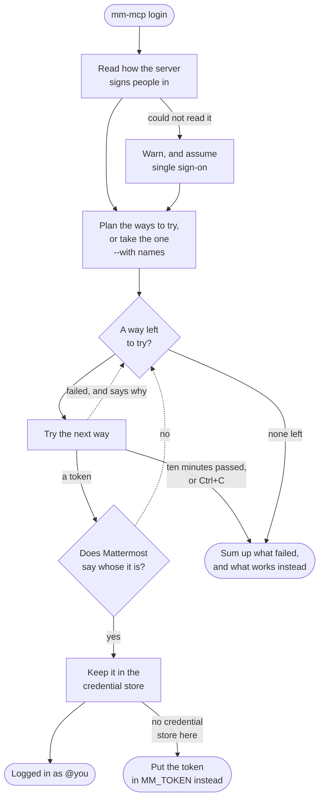
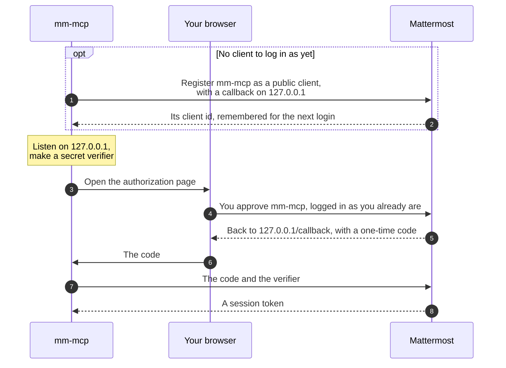
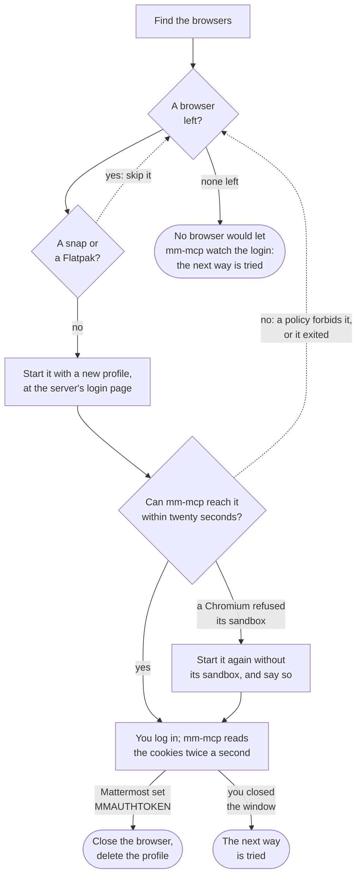

# Logging in

Where your Mattermost lets you make a personal access token, that token is the
simplest way in: put it in `MM_TOKEN` ([Installation](installation.md)). Many
organisations switch those tokens off, often to keep programs and agents out;
[that no longer works](#why-letting-agents-in-is-the-safer-choice), and an
administrator can open a proper way in instead. Until then, log in once with
your own account:

```bash
mm-mcp login --url https://chat.example.com
```

and set only `MM_URL` for the server, without `MM_TOKEN`. mm-mcp keeps the
session in your system's credential store: the Windows Credential Manager, your
macOS keychain, or your Linux desktop's Secret Service. When Mattermost ends the
session, run `mm-mcp login` again; `mm-mcp logout` ends it yourself
([ADR-019](adr/019-credentials-are-supplied-not-acquired.md)).

## How mm-mcp logs you in

Before it opens anything, mm-mcp reads how your server signs people in, which
any server says to anyone: its login page's settings, and whether it is an OAuth
authorization server. From that it makes a plan, a list of ways to log in, and
tries them one after the other until one gives it a session Mattermost accepts.



Every way that fails says why before the next is tried. When none is left,
mm-mcp sums up each way it tried and why it failed, and what would work for your
server: Playwright's Chromium, a token, or the change to ask your administrator
for. The whole login waits at most ten minutes.

```text
mm-mcp found no way to log in to https://chat.example.com that worked:
  - browser window: no browser would let mm-mcp watch the login: Chrome opened no DevTools port within 20s; …
  - pasted token: no token was given

What works from here:
  - A browser window: install Playwright's Chromium, which no company policy for Chrome or Edge reaches, with
      npx playwright install chromium
    and run mm-mcp login again.
  …
```

### The order it tries them in

| What your server offers | What mm-mcp tries, in order |
|---|---|
| Single sign-on, perhaps beside passwords | a browser window, then your password if the server keeps passwords or uses LDAP, then a pasted token |
| Passwords or LDAP, without single sign-on | your password, then a browser window, then a pasted token |
| Neither that mm-mcp can see, or it could not read the server | a browser window, then a pasted token |

OAuth comes before all of these when the server's OAuth service is on and
mm-mcp has a client to log in as: the server lets it register one itself, you
gave one with `--client-id`, or an earlier login remembered one. `--with oauth`,
`--with window`, `--with password` or `--with paste` tries only that way.

### The four ways

1. **OAuth, in your own browser.** mm-mcp opens Mattermost's authorization
   page in your default browser, whichever it is, Safari included, with your
   everyday profile. You are usually logged in there already, so you only
   approve mm-mcp. Mattermost sends your browser back to a page mm-mcp serves on
   `127.0.0.1` with a one-time code, which mm-mcp exchanges for a session.
   Nothing reads your browser's cookies ([below](#oauth-step-by-step)).
2. **A browser window of mm-mcp's own**, for single sign-on: SAML, Entra ID,
   OpenID Connect, GitLab, Google. mm-mcp starts a Chrome, Edge, Chromium or
   Firefox installed on your machine, or the Chromium Playwright downloads, with
   a profile of its own that it deletes afterwards, at your server's login page.
   You log in as you always do, second factor included; mm-mcp watches the
   window's cookies until Mattermost sets its session cookie, and closes it.
   Because the profile is new, you log in fresh there, even when your everyday
   browser is logged in ([below](#the-browser-window)).
3. **Your password, in the terminal**, where your server keeps passwords or
   signs people in with LDAP: an email address or username, the password, and
   your authenticator's code when your account has a second factor. An account
   made through single sign-on has no password in Mattermost, and is told so.
4. **A token you paste**, as the last resort: a personal access token, a bot's
   token, or the value of the `MMAUTHTOKEN` cookie your browser holds for the
   server, from its developer tools while you are logged in (Application or
   Storage, then Cookies). The terminal does not show what you type, and a
   token piped into the command is read as it is.

Whatever way you log in, mm-mcp asks Mattermost whose the session is before it
keeps it, and says so: `Logged in to https://chat.example.com as @you`.

## OAuth, step by step

mm-mcp logs in as a program on your machine does under OAuth (RFC 8252), with
PKCE in place of a client secret, so a code another program catches on the way
is of no use to it:



The page on `127.0.0.1` says whether mm-mcp is logged in; you can close the tab
then. A callback that does not answer the login mm-mcp started is turned away.

## The browser window

mm-mcp drives none of the login page itself: it only starts the browser, opens
the page, and reads the browser's cookies, a Chromium's through its DevTools
protocol and a Firefox's through WebDriver BiDi.



The browsers are the one `--browser` names, alone, or else every Chrome, Edge,
Firefox and Chromium installed, in that order, and then Playwright's Chromium,
newest first. On Windows and macOS, mm-mcp looks where each browser's installer
puts it; on Linux, for `google-chrome`, `microsoft-edge`, `firefox` and
`chromium` on your `PATH`. Playwright's Chromium is in your user folder, or
under `PLAYWRIGHT_BROWSERS_PATH` when you set it.

### When the window will not open

A browser can refuse to be watched:

- **A company policy** that forbids remote debugging in Chrome or Edge. mm-mcp
  waits twenty seconds for the browser, names it, and tries the next one.
- **A snap or a Flatpak browser** on Linux, whose sandbox keeps it from using a
  profile of mm-mcp's.

On Ubuntu 24.04, a Chromium without an AppArmor profile, Playwright's included, is
refused its own sandbox; mm-mcp then starts it without one, as Playwright does,
and says so. The window shows only your login page and closes once you have
logged in.

Playwright's Chromium is a browser of your own, in your user folder, which those
policies do not reach. Install it once, with Node:

```bash
npx playwright install chromium
```

and run `mm-mcp login` again: mm-mcp finds it on its own. `--browser` names any
other Chrome, Edge, Chromium or Firefox, by path or command.

Your organisation's single sign-on may also require a managed device or browser,
as Entra ID's Conditional Access and Okta's device trust can. A fresh profile is
then refused at the sign-on page itself, Playwright's included; OAuth in your own
browser, or a pasted token, still works.

## When the login fails

mm-mcp names what failed, before it tries the next way:

| It says | Which means | What to do |
|---|---|---|
| `warning: reading how … lets people sign in` | The server's login settings did not answer; mm-mcp assumes single sign-on | Check the address is the one you open Mattermost at |
| `… opened no DevTools port within 20s`, or `started no remote agent` | A company policy forbids watching that browser | Install Playwright's Chromium ([above](#when-the-window-will-not-open)) |
| `… is installed as a snap or a Flatpak` | Its sandbox keeps out mm-mcp's profile | Install Playwright's Chromium, or name another browser with `--browser` |
| `no browser would let mm-mcp watch the login` | Every browser found refused | The same |
| `the browser was closed before the login finished` | The window closed before Mattermost set its session cookie | Run `mm-mcp login` again, and log in before you close it |
| `the server lets no OAuth client register itself, and no client id was given` | OAuth is on, but mm-mcp has no client to log in as | Ask your administrator for [one of two changes](#what-to-ask-your-administrator) |
| `listening for the OAuth callback on port …` | Another program holds the callback's port | Close it, or use `--callback-port` when the app's callback names another |
| `mm-mcp was not authorized` | You, or the server, refused mm-mcp on the authorization page | Approve it, or try `--with window` |
| `the account signs in through single sign-on and has no password` | Your account has no password in Mattermost | `mm-mcp login --with window` |
| `nothing could be read here` | The password or token prompt runs where nobody types, as in an AI agent's shell | Run `mm-mcp login` in a terminal of your own |
| `the token does not work` | Mattermost refused what the way obtained | The next way is tried; a pasted token may be mistyped or revoked |
| `… Set the token as MM_TOKEN in the MCP client's env block instead` | Your system has no credential store mm-mcp can use, as on a Linux without a desktop | Put the token in `MM_TOKEN`, from `--with paste` or a personal access token |

## Where the session is kept, and when it ends

mm-mcp keeps one session per server, under the name `mm-mcp`, in the Windows
Credential Manager, your login keychain on macOS, or your desktop's Secret
Service on Linux, such as GNOME Keyring or KWallet. It also keeps, under
`mm-mcp-oauth-client`, the OAuth client it logged in as, which is no secret, so
the next login uses it again.

`mm-mcp serve` uses the stored session whenever `MM_URL` names that server and
`MM_TOKEN` is not set; a token in `MM_TOKEN` always goes first. A session ends
when Mattermost expires it, or when it is revoked, by you under Profile >
Security or by an administrator. `mm-mcp serve` then stops at start with
`refused the session mm-mcp login stored`; run `mm-mcp login` again, and restart
the MCP server. `mm-mcp logout` ends the session at Mattermost and forgets it.

## When the tools still do not work

```bash
mm-mcp doctor --url https://chat.example.com
```

checks the login you stored and everything around it, and says what to fix:
whether a login is stored under that address in your credential store, whether
the store can be read at all, whether an `MM_TOKEN` hides the login, whether
the server can be reached and still accepts the session, and how
`mm-mcp login` would log you in. The most common causes:

- **`MM_TOKEN` is still set** in your MCP client's configuration. It wins over
  a stored login; remove it.
- **Another spelling of the address.** A login is stored under the address you
  logged in with: `http` is not `https`, and another host name for the same
  server is another entry. Log in with the address `MM_URL` names.
- **No credential store.** On Linux, the Secret Service runs with your desktop
  session; over SSH, in WSL or in a container there is none. Use a token in
  `MM_TOKEN` there.

The command reads your terminal's environment, not your MCP client's. From
inside the client, ask the model to call the `diagnose` tool: it makes the same
checks with the client's own configuration, and says whether the client can
show the question mm-mcp asks before each write.

## Why letting agents in is the safer choice

This part is for administrators, and for whoever writes the policy they follow.

An AI agent no longer needs mm-mcp, or any token, to reach Mattermost. Ask a
coding agent today to do something in Mattermost, and without an integration it
drives a browser: through computer use or a browser extension, it opens
Mattermost where the person is already logged in, and reads and types as them.
Switching personal access tokens off, forbidding remote debugging, or requiring
a managed device stops none of that. As long as an agent can drive the
browser a person is logged in to, Mattermost is open to it.

What a policy does decide is the way the agent comes in:

| | Through the person's browser | Through mm-mcp |
|---|---|---|
| What it reads | Whatever is on the screen, Mattermost or not | Mattermost, through its API, nothing else |
| Posting | As the person, unmarked | Not offered until writes are allowed |
| Before a post others see | Nobody is asked | A person is asked by default ([ADR-021](adr/021-read-only-by-default-and-every-write-asks.md), [ADR-033](adr/033-who-asks-before-a-write-is-a-setting.md)) |
| Telling its posts apart | Impossible | Marked as written with AI, as Mattermost shows it, by default |
| Telling its requests apart | Impossible | `User-Agent: mm-mcp/<version>` |
| Ending it | Ending the session the person works in | Ending the one session mm-mcp keeps |

So the safer choice is to make the agent visible and give it a proper way in,
rather than to try to keep it out: one of the two changes below. mm-mcp then
logs in through the person's own browser, in one click, and the browser window
of its own, Playwright's Chromium and the pasted token are not needed.

This will not satisfy every security policy, and it is not meant to. It is the
honest trade: a policy that closes the proper ways in does not keep agents
out. It moves them to the way nobody can see. Large organisations may take
years to come to that; the sooner they do, the less of their Mattermost is used
unseen.

## What to ask your administrator

One change on the server lets everyone log in through their own browser, in
one click:

- **Turn on dynamic client registration**: System Console > Integrations >
  Integration Management > Enable OAuth 2.0 Service Provider, and Enable Dynamic
  Client Registration. mm-mcp then registers itself once per person and server.
  Any program that reaches the server can then register an OAuth app, as the
  standard intends; an app gets nothing until a person logged in to Mattermost
  approves it.
- **Or register one OAuth app for mm-mcp**: a public client, without a secret,
  with the callback `http://127.0.0.1:8766/callback`, and share its client id.
  Everyone then runs `mm-mcp login --client-id <id>` once; mm-mcp remembers it
  for the server. `--callback-port` uses another port, when the app's callback
  names one.

To see what your server offers, open
`https://chat.example.com/.well-known/oauth-authorization-server`: an error page
means its OAuth service is off; a JSON answer means it is on, and with a
`registration_endpoint` in it, mm-mcp can register itself.

## With an AI agent

An agent can run `mm-mcp login` for you: OAuth and the browser window need
nothing typed, so you log in in the window or approve in your browser. Your
password and a pasted token are typed into a terminal, which an agent's shell is
not; there, mm-mcp says to run it in a terminal you can type in. Never paste a
token into the conversation: run `mm-mcp login --with paste` yourself and paste
it at the command's own prompt. When nothing works, mm-mcp ends with what it
tried and what to do next, which an agent can read to you.
