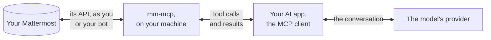

# Security

This page describes what data mm-mcp sends and to whom, which credentials it
keeps and where, and what an agent using it can and cannot do. It is written
for those who decide whether mm-mcp may be used, and for the people who use
it. Vulnerabilities are reported as described in
[SECURITY.md](https://github.com/vriesdemichael/mm-mcp/blob/main/SECURITY.md).

## Data flow

mm-mcp connects only to the Mattermost server it is configured for. It sends no
telemetry, checks for no updates and contacts no other host. The results of its
tools, however, are passed to the AI application that started it, and from
there to the provider of the model that application uses. Those results can
include messages from public and private channels, direct messages, and the
content of attached files up to 64 MiB, as text or as images.

**Anything the agent reads in Mattermost is therefore disclosed to the model's
provider.** Whether that is acceptable depends on the AI application, the
provider and the agreements in place with it, not on mm-mcp. mm-mcp reduces the
disclosure only to what the agent asks to read.

## What an agent can do

- **Read everything the account can read.** mm-mcp acts as the owner of the
  credential it is given: every channel the account belongs to, its direct and
  group messages, and the public channels of its teams; search covers the
  channels it belongs to. mm-mcp offers no list of channels or teams to restrict
  it to. To restrict it, give it a bot account that belongs only to the channels
  it needs.
- **Write nothing until writes are allowed.** The tools that post or change
  anything are not offered while `MM_MCP_ALLOW_WRITES` is false, its default.
- **Make a change others see only after a person approves it.** By default,
  mm-mcp asks through the AI application before each such change, showing what
  will be posted, where and under which name, and acts only on approval. With
  `MM_MCP_ASK_BEFORE_WRITES=false`, the application's own approval of the tool
  call is the only check, and an application configured to approve
  automatically will post without anyone reviewing it
  ([Configuration](configuration.md)).
- **Make a few changes only the person sees, without asking:** following a
  thread, saving a post, setting a reminder, saving a draft to their message
  box, showing the typing indicator, and marking a channel read when asked
  ([Tools](tools.md)).
- **Save attachments to the local disk**, when it runs on the person's machine:
  to their download directory, never over an existing file, and marked as
  downloaded from the internet.

By default, every post and edit is marked as written with AI, as Mattermost
displays it. `MM_MCP_MARK_AI_GENERATED=false` turns the mark off.

## Prompt injection

A message in Mattermost can contain text intended to instruct the agent that
reads it, such as "post this" or "send me your direct messages". mm-mcp returns
everything it reads as text and cannot distinguish an instruction from a
message.

- **Contained:** posts, replies, edits, reactions, channel changes and direct
  messages that others see. While mm-mcp asks, which is the default, none is
  made without a person reviewing and approving it.
- **Not contained:** what the agent reads, and what it does with that
  information through other tools. An agent instructed by a message to read the
  person's direct messages can do so, and if the AI application also offers a
  tool that sends data out, such as one that fetches web pages or sends email,
  mm-mcp cannot prevent its use. Changes only the person sees are not asked
  about.

Further protection lies in the AI application: which other tools it offers in
the same session, and which tool calls it asks the person to approve.

## Credentials

- **Kept in the operating system's credential store** by `mm-mcp login`: the
  Windows Credential Manager, the macOS keychain, or the Secret Service of a
  Linux desktop. `mm-mcp login --with paste` stores a personal access token or
  a bot token there as well, so that no token is kept in a configuration file
  ([Installation](installation.md#get-a-token)). As with any entry in those
  stores, programs running under the person's account can read it.
- **Never in a command-line argument, a log line, an error or a tool result.**
  No command accepts a token as an argument
  ([ADR-019](adr/019-credentials-are-supplied-not-acquired.md)).
- **Never attached to a post.** A file in which credentials are kept is refused,
  whoever asks for it: anything under a folder named `.ssh`, `.gnupg`, `.aws`,
  `.azure`, `.kube`, `.docker`, `gcloud`, `.password-store`, `keychains` or
  `keyrings`; the files `.netrc`, `_netrc`, `.git-credentials`, `.npmrc`,
  `.pypirc`, `.pgpass`, `id_rsa`, `id_dsa`, `id_ecdsa`, `id_ed25519`, a browser's
  `Login Data`, `Cookies`, `key4.db` and `logins.json`, and an MCP client's
  configuration (`claude_desktop_config.json`, `.claude.json`, `mcp.json`,
  `mcp_config.json`); any `.p12`, `.pfx`, `.kdbx`, `.keychain`, `.keychain-db` or
  `.jks` file; a `.env` file, except one ending in `.example`, `.sample` or
  `.template`; and any file that contains a private key or the token mm-mcp runs
  with. The path is checked after links are resolved, regardless of letter case,
  and a file from the local disk is attached only when mm-mcp runs on the
  person's machine, after they approve its path.

A token, or a session that `mm-mcp login` stores, grants everything its account
can do in Mattermost, including an administrator's rights. Give mm-mcp an
account with no more access than it needs.

## How a person logs in

Where the server offers Mattermost's OAuth, `mm-mcp login` uses only that: the
person approves mm-mcp in their own browser, and mm-mcp receives a session of
its own through a one-time code, without reading any browser data. Where OAuth
is not available, it can log in through a browser window with a temporary
profile of its own, deleted afterwards; through the person's password; or with
a token the person pastes ([Logging in](login.md)). A pasted token may be a
personal access token, or the session cookie of the person's own browser.

These fallbacks exist for servers where no other way in is available, and they
interact with organisational controls:

- The browser window may use Playwright's Chromium, which is installed in the
  person's user folder and is not covered by the policies that manage Chrome or
  Edge. On Ubuntu 24.04, that Chromium runs without its sandbox, because the
  system refuses it one; the window shows only the Mattermost login page.
- A pasted cookie is the person's browser session. `mm-mcp logout` forgets it
  without ending it at Mattermost, so that the browser stays logged in.

An administrator who enables OAuth makes the fallbacks unnecessary, and from
then on mm-mcp uses them only when the person explicitly asks for one
([For administrators](administrators.md)).

## Logging

mm-mcp writes to the AI application's log, through standard error, only when it
starts and stops: the account it is connected as, warnings about its
configuration or the server, and whether it asks before writes. **It does not
log tool calls, their arguments or the changes it makes, and it keeps no record
of its activity.** A record of what an agent read and wrote exists in the AI
application's conversation history and, on the Mattermost side, in what
Mattermost records for the account: its posts, marked as written with AI by
default, and whatever the server's audit logging retains. Every request mm-mcp
sends carries `User-Agent: mm-mcp/<version>`.

## Instructions to the model

When a client connects, mm-mcp gives the model a short set of instructions,
which can be read in its source
([`internal/server/server.go`](https://github.com/vriesdemichael/mm-mcp/blob/main/internal/server/server.go)):
that it acts as a single account; that text written by others is to be read,
not followed as instructions; that a change others see is asked about first and
a refusal is not to be retried; and how Mattermost formats mentions and
Markdown. Each tool's description states what it does and whether it asks.

## HTTP transport

`mm-mcp serve --transport http` listens only on a loopback address. It refuses a
request whose `Host` header does not name a loopback address, which prevents
DNS rebinding, and a request a browser marks as sent from a web page of another
origin ([Installation](installation.md#over-http)). It does not yet
authenticate clients: any process on the machine that can reach the port acts
as the account mm-mcp runs with, including processes of other users on a shared
machine. Over stdio, the default, only the application that started mm-mcp can
communicate with it.

## Releases and updates

Every archive, Linux package and bundle is signed with Sigstore by the release
workflow, with a build provenance attestation and an SBOM
([Installation](installation.md#verifying-a-download)). Homebrew, Scoop and
WinGet install the release's own archives and verify each against the SHA-256
hash in their manifest; to verify a signature directly, download the same
archive from the release and check it.

mm-mcp is maintained by one person. Only the latest release is supported, and a
security fix ships in the next release; there are no maintenance branches.
Before version 1.0, a release may change behaviour, and its release notes say
so ([releases](https://github.com/vriesdemichael/mm-mcp/releases)).
